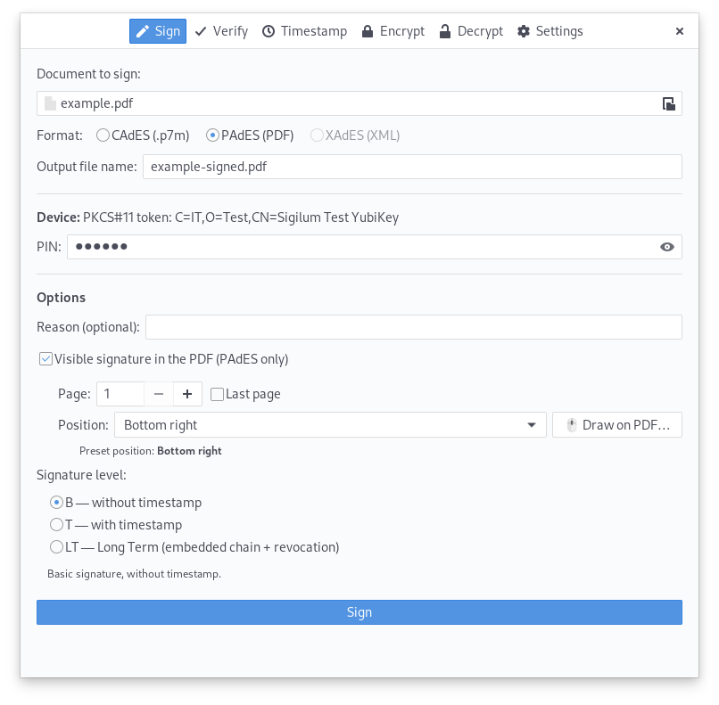

# Sigillum

Sigillum is a desktop application for digitally signing, timestamping, encrypting, and verifying documents in the following formats:

- **PAdES** (signed PDFs)
- **CAdES** (.p7m enveloping)
- **XAdES** (enveloped XML)
- **TSR / TSD** (standalone timestamp — RFC 3161 / ETSI TS 119 422)
- **Symmetric (`.enc`) and asymmetric (CMS EnvelopedData `.p7e`) encryption

It supports credentials from files (PKCS#12) and hardware tokens via PKCS#11 (YubiKey, Bit4id Digital-DNA Key, smartcards via OpenSC), RFC 3161 timestamping (level T for signatures, standalone timestamp for files), even on qualified TSAs with HTTP Basic Auth, and chain validation against the imported AgID Trust List. locally.



## Features

- PAdES Level B and T Signature
- CAdES Level B and T Signature (`.p7m` Enveloping)
- XAdES Level B and T Signature (enveloped in XML)
- Standalone Timestamp of any file: `.tsr` (evidence only, requires the original for verification) or `.tsd` (self-consistent ETSI TS 119 422 envelope with content + embedded evidence)
- Encryption of file in four ways: symmetric with password (AES-256/AES-128/3DES/Blowfish in CBC + PKCS#7 + PBKDF2-SHA256), asymmetric against the configured certificate (token or file), asymmetric against a certificate from a PKCS#12 file
- Verification of PAdES/CAdES/XAdES signatures and timestamps `.tsr` / `.tsd` with separate checks for hash, signature, signer chain, timestamp, TSA chain
- **Visible signature** on PDF: preset angle, page, optional logo, and graphical selection of the frame with the mouse on the PDF preview
- **Auto-detection** of the PKCS#11 token + compatible driver
- **Preview of the signature frame** in the settings
- Device configuration, TSA (URL + optional Basic Auth) and logo persisted in `~/.config/sigillum/settings.json` (0600 because it may contain TSA passwords)
- Import of national Trust Lists (TSLs) for **any EU/EEA member state** discovered via the EU LOTL; per-country PEM bundles, multi-country verification
- Primary country derived from `$LANG` (Italian by default), with an explicit override and a list of additional countries to include in the verification trust store
- Background auto-refresh of the primary country's TSL at startup if missing or older than 30 days
- Validation of the cert chain via manual walker (necessary because qualified Italian certs often do not have the required `subjectAltName`) (`cryptography.PolicyBuilder`)
- XMLDSig verification of the TSL signature with EU LOTL-anchored trust check (ETSI TS 119 612). Supports both RSA-PKCS1v15 (most countries) and RSA-PSS/MGF1 (Germany, etc.)

Current limitations:

- LTA levels not yet implemented in the signer
- The `sigillum.core.tsa` module is a stub: signature timestamping is passed through `endesive`; The standalone timestamp (`.tsr` / `.tsd`) is in `sigillum.core.timestamp`

[Contributing Guide](contributing.md)

## Requirements

- Linux
- Python ≥ 3.11
- GTK 3 + GObject introspection (`PyGObject`)
- Poppler with GI bindings (for PDF preview in the visible signature picker)

Python dependencies (defined in `pyproject.toml`):

- `endesive` — PAdES/CAdES signing/verification
- `PyKCS11` — token access via PKCS#11
- `cryptography` — cryptographic primitives and X.509 parsing
- `asn1crypto` — low-level CMS/X.509 manipulation
- `PyGObject` — GTK / GLib / Cairo / Poppler binding
- `requests` — HTTP calls (TSL AgID, FreeTSA CA)
- `lxml` — XAdES (XML signing)

## Installation

`PyGObject` is normally installed as a system package, so the recommended setup is a virtualenv with `--system-site-packages` to avoid duplicating it.

### From PyPI

```bash
python3 -m venv --system-site-packages .venv
source .venv/bin/activate
pip install -U pip
pip install sigillum
```

### From `.deb` / `.rpm` package

Native packages are published as assets on every [GitHub Release](https://github.com/piuma/sigillum/releases). Pick the file matching your distro:

```bash
# Fedora / RHEL
sudo dnf install ./sigillum-<VERSION>.fc44.noarch.rpm
```

```bash
# Debian / Ubuntu / Mint
sudo apt install ./sigillum_<VERSION>_all.deb
```

The packages declare all runtime dependencies (GTK 3, Poppler, `python3-endesive`, etc.) so no virtualenv is needed. To build the packages yourself instead of downloading them, see [`packaging/README.md`](packaging/README.md).

### From source

For development or to run the latest unreleased changes:

```bash
git clone https://github.com/piuma/sigillum.git
cd sigillum
python3 -m venv --system-site-packages .venv
source .venv/bin/activate
pip install -U pip
pip install -e .
```

## Startup

After installation:

```bash
sigillum # starts the GUI (default)
sigillum --help # lists CLI subcommands
```

Or without an install script:

```bash
PYTHONPATH=src python -m sigillum [subcommand]
```

## Quick Use

1. Open the **Settings** tab.
2. **Signing Device**: Choose PKCS#12 File or PKCS#11 Token.
- For the token: click **"🔍Automatically detect token"** — Sigillum tries known PKCS#11 drivers (YubiKey, Bit4id, OpenSC, and Bit4id installed under `~/infocamere`, `~/aruba`, `~/dike*`) and select the first one that returns certificates.
3. **Timestamp (TSA)**: Optional. Choose a preset (FreeTSA, Aruba PEC, InfoCert, Namirial, DigiCert) or enter a custom URL. If the TSA requires HTTP Basic Auth (qualified Italian TSAs), enter your username and password.
4. **Visible signature**: Optional PNG/JPG logo that will appear to the left of the signature text. The preview shows how the box will look.
5. **AgID Trust List**: Click "Import from TSL AgID" to download the certificates of qualified Italian CAs. Sigillum can also do this automatically if the file is more than 30 days old or has never been imported.
6. Save.
7. Go to **Sign**: select the file, optionally enable timestamping and visible signature (with position presets or "🖱 Draw on PDF..." to select with the mouse), enter your PIN/password, and sign.
8. **Standalone Timestamp** (without signature): go to the **Timestamp** tab, select any file, choose TSR or TSD format (see the dedicated section below), and click "Timestamp." The output is saved alongside the source as `documento.ext.tsr` or `documento.ext.tsd`.
9. Verify signed or stamped files from the **Verify** tab: the format is deduced from the extension (`.pdf`, `.p7m`, `.xml`, `.tsr`, `.tsd`). For `.tsr` files, the original file is also requested. The trust store uses the imported AgID TSL by default; additional CAs (including for the TSA) can be added from the "Additional Options" tab.

## CLI

All GUI functions are also available from the command line. Without
subcommands, `sigillum` launches the GUI; with a subcommand, it performs the operation
and exits. PINs and passwords can be passed via an environment variable or an
interactive prompt.

| Variable | For what |
|---|---|
| `SIGILLUM_PIN` | PKCS#11 token PIN |
| `SIGILLUM_PASSWORD` | PKCS#12 file password / symmetric password |
| `SIGILLUM_TSA_PASSWORD` | TSA HTTP Basic Password |

Available subcommands:

```bash
sigillum sign <file> [-o OUT] [--level B|T|LT] [--visible] [--position …] 
[--image LOGO] [--reason …] [--cert P12 | --lib LIB --cert-id ID] 
[--tsa URL --tsa-user U --tsa-password P]
sigillum verify <file> [--original FILE] [--trusted CA.pem] [--tsa-trusted CA.pem] [--json]
sigillum timestamp <file> [-o OUT] [--format tsr|tsd] [--tsa URL …]
sigillum encrypt <file> [-o OUT] [--mode sym|asym] [--algo AES-256|AES-128|3DES|Blowfish] 
[--recipient CERT.p12]
sigillum decrypt <file> [-o OUT] [--cert P12 | --lib LIB --cert-id ID]
sigillum tsl-import
sigillum detect [--json]
sigillum config show [--json]
sigillum config set [--cert P12 | --lib LIB --cert-id ID]
[--tsa URL --tsa-user U --tsa-password P]
[--image LOGO --position …]
sigillum gui
```

The signature format is derived from the file extension (`.pdf` → PAdES,
`.xml` → XAdES, otherwise CAdES). Credentials and the TSA use the
saved configuration if explicit flags are not passed. At level B,
no TSA is contacted, even if one is present in the Settings — to
apply a timestamp, use `--level T` (or `--level LT`).

Examples:

```bash
# PAdES B signature with .p12
SIGILLUM_PASSWORD=secret sigillum sign document.pdf --cert my.p12 -o document.signed.pdf

# PAdES T signature with visibility in the lower right corner + logo
SIGILLUM_PASSWORD=secret sigillum sign report.pdf --cert my.p12 \
--level T --tsa https://freetsa.org/tsr \
--visible --position bottom-right --image logo.png --reason "Approved"

# PAdES LT signature with YubiKey token
SIGILLUM_PIN=123456 sigillum sign report.pdf \
--lib /usr/lib64/libykcs11.so.2 --cert-id 02:9c67ef95f0e64305 \
--level LT --tsa https://freetsa.org/tsr

# Verify with JSON output (parseable by script)
sigillum verify document.signed.pdf --json

# Standalone timestamp .tsd with TSA configured
sigillum timestamp document.pdf --format tsd

# AES-256 symmetric encryption + decryption
SIGILLUM_PASSWORD=pwd sigillum encrypt secret.txt -o secret.enc
SIGILLUM_PASSWORD=pwd sigillum decrypt secret.enc -o secret.recovered.txt

# Asymmetric encryption to a recipient (cert in .p12, public key)
sigillum encrypt secret.txt --mode asym --recipient recipient.p12

# Import TSL AgID and token detection
sigillum tsl-import
sigillum detect
```

Exit code: `0` success, `1` User error (incorrect argument, missing file),
`2` Service error (TSA unreachable, network), `3` Signature verification failed
(untrusted chain, invalid hash, etc.).

## Multi-country eIDAS support

Sigillum supports the Trust Lists of every EU/EEA member state. The list of countries is discovered dynamically from the EU LOTL (`https://ec.europa.eu/tools/lotl/eu-lotl.xml`) — no hardcoded URLs.

**Primary country**: derived from `$LANG` (e.g. `it_IT` → Italy, `de_DE` → Germany). Override via the GUI dropdown or the CLI:

```bash
sigillum config set --country DE              # set the primary country
sigillum config set --country ""              # clear → fall back to $LANG
```

**Active countries** (those whose CAs are loaded into the verification trust store): defaults to the primary one. Add more to verify signatures issued in other countries:

```bash
sigillum config set --active-countries IT,DE,FR
```

**Per-country import**:

```bash
sigillum tsl-import                # imports the primary country
sigillum tsl-import --country DE   # import a specific country
sigillum tsl-list                  # show every imported country with its age
```

The TSL XMLDSig signature is verified against the certificates published in the EU LOTL (LOTL-anchored trust). Both PKCS1v15 and PSS/MGF1 signatures are accepted — the former is used by Italy and most member states, the latter by Germany among others.

In the GUI, the **Settings → TSL** panel shows a primary-country dropdown, a list of imported countries with per-row refresh/remove buttons, and a *"+ Add EU country"* dialog.

## PKCS#11 Token

Auto-detection proven on:

- **YubiKey** PIV — `libykcs11.so.2`
- **Bit4id Digital-DNA Key** (CCIAA / InfoCamere / Aruba / Namirial token) — proprietary `libbit4xpki.so`, from Aruba Sign / InfoCamere Sign Desktop / Dike
- Generic **CNS / CIE Smartcards** via `opensc-pkcs11.so` (OpenSC)

For live testing with YubiKey (requires hardware + PIN via env):

```bash
SIGILLUM_PIN=<pin> .venv/bin/python tests/test_pkcs11_yubikey.py
```

## Note on Italian CNS cards and OpenSC
OpenSC cannot read the *qualified signing certificate* (DS) on most Italian CNS cards (Athena, IDEMIA, Bit4id JS, etc.): only the authentication certificate (CNS) is visible. The signing key/cert pair is protected by **Secure Messaging** with a static symmetric key embedded in the vendor's proprietary PKCS#11 module, and OpenSC has no way to derive it — `pkcs11-tool --list-objects` and `pkcs15-tool -D` will simply not show the DS object. Additionally, the DS object location is not standardised: every manufacturer chooses its own. This is tracked upstream in [OpenSC#2782](https://github.com/OpenSC/OpenSC/issues/2782) and is unlikely to be fixed without reverse-engineering each vendor's SM key.

Practical consequence: to sign with an Italian CNS / firma qualificata you must install the **proprietary middleware** shipped with Aruba Sign / InfoCamere Sign Desktop / Dike (`libbit4xpki.so` and friends). Sigillum's auto detect token function already prefers the proprietary driver over OpenSC when both are present.

We sincerely hope that the SM key can be extracted to allow OpenSC to work with Italian CNS and to prefer OpenSC to proprietary drivers.

## Standalone Timestamp (TSR / TSD)

In addition to timestamping **within a signature** (PAdES/CAdES/XAdES level T), Sigillum can timestamp any file without signing it—useful for proof-of-existence, audit trail, archiving, etc.

The output format is optional:

- **TSR** (`.tsr`) — the file contains only the TSA response (DER `TimeStampToken` RFC 3161): the SHA-256 fingerprint of the document, the `gen_time` certified by the TSA, and the TSA signature itself. It's small (~4-5 KB), but you need the original file to verify it.
- TSD (`.tsd`) — ETSI TS 119 422 TimeStampedData envelope (CMS ContentInfo with OID `1.2.840.113549.1.9.16.1.31`) containing both the TSR and the complete original file. It's self-consistent: verification doesn't require any additional files.

| Feature | TSR | TSD |
|---|---|---|
| Size | small (TST only, ~4-5 KB) | TST + original file + metadata |
| File to verify | the `.tsr` + the original | the `.tsd` only |
| Interop | Pure RFC 3161 | ETSI TS 119 422 (Aruba/InfoCert/Namirial) |
| When to use it | You already have the file and just want to timestamp it | Long-term preservation, archiving |

To generate a timestamp: **Timestamp** tab → file → TSR/TSD radio → "Timestamp". The TSA URL is read from the Settings ("Timestamp" section); if the TSA is an Italian QTSP with HTTP Basic Auth, the username/password must also be entered.

To verify it: **Verify** tab → select the `.tsr` or `.tsd` file like any other signed file. If it is a `.tsr`, a second file chooser will appear where you can specify the corresponding original document. Verification produces the same flags as signatures: hash valid, signature valid, cert trusted, timestamp gen_time, TSA trusted.

Extracting content from a `.tsd` (without verification) — useful from a script:

```python
from sigillum.core.timestamp import extract_tsd_content
fname, content = extract_tsd_content("document.txt.tsd")
# fname == "document.txt" (if present in the MetaData)
# content == bytes of the original file
```

## Encryption

Sigillum encrypts one or more files with four modes, accessible from the **Encrypt** tab:

### Symmetric with password

Container in **SIGILLUM** format (custom, well-defined): magic `SIGILLUM` + version + algorithm name + salt (16B) + IV + ciphertext. Key derivation via **PBKDF2-SHA256 with 600,000 iterations** (NIST SP 800-132 2024 recommendation). **PKCS#7** padding, **CBC** mode.

Selectable algorithms:

| Algorithm | Key | Block | Note |
|---|---|---|---|
| **AES-256** *(default)* | 256 bit | 128 bit | recommended |
| **AES-128** | 128 bit | 128 bit | fastest,Adequate security |
| **3DES** | 168 effective bits | 64 bits | legacy, accepted for interop |
| **Blowfish** | 128 bits | 64 bits | legacy |

Output: `<original>.enc`.

### Asymmetric (CMS EnvelopedData)

Compatible with **RFC 5652 EnvelopedData** (the same one produced by Aruba Sign, Dike, and InfoCamere when "Encrypt for recipient X"). Outer layer: ContentInfo with `content_type=enveloped_data`. Content encrypted with a random AES-256-CBC session key; the session key is wrapped with the recipient's public RSA key via **RSAES-PKCS1-v1.5**.

Two flows:

- **To the certificate configured** in Settings — useful for "self-encryption" (archive use, preservation)
- **To a certificate from a `.p12` file** — useful for encrypting to a third party (upload the `.p12` with the recipient's public key)

Output: `<original>.p7e`.

### Decryption

Auto-detect the format from the file contents:

- Magic `SIGILLUM` → the password is requested and the algorithm name is read from the container
- ContentInfo with `enveloped_data` → the credential (PKCS#11 token or `.p12` file) is used to unenvelope the session key and then decrypt the contents

Output: `<original>.dec` (`.enc`/`.p7e` extension removed).

Python API (scriptable use):

```python
from sigillum.core.crypto import encrypt_symmetric, decrypt_symmetric
blob = encrypt_symmetric(b"secret data", "passw0rd", algorithm="AES-256")
recovered = decrypt_symmetric(blob, "passw0rd")
```

```python
from sigillum.core.crypto import encrypt_asymmetric, decrypt_asymmetric
from sigillum.core.credentials import FileProvider
cred = FileProvider("destinatario.p12").unlock("destinatario.p12", "pwd")
blob = encrypt_asymmetric(b"secret data", cred.certificate)
# … who has the private key:
recovered = decrypt_asymmetric(blob, cred)
```

## License

This program is released under the terms of the GNU General Public License (GNU GPL), either version 3.0, or (at your option) any later version.

You can find a copy of the license in the file LICENSE.


